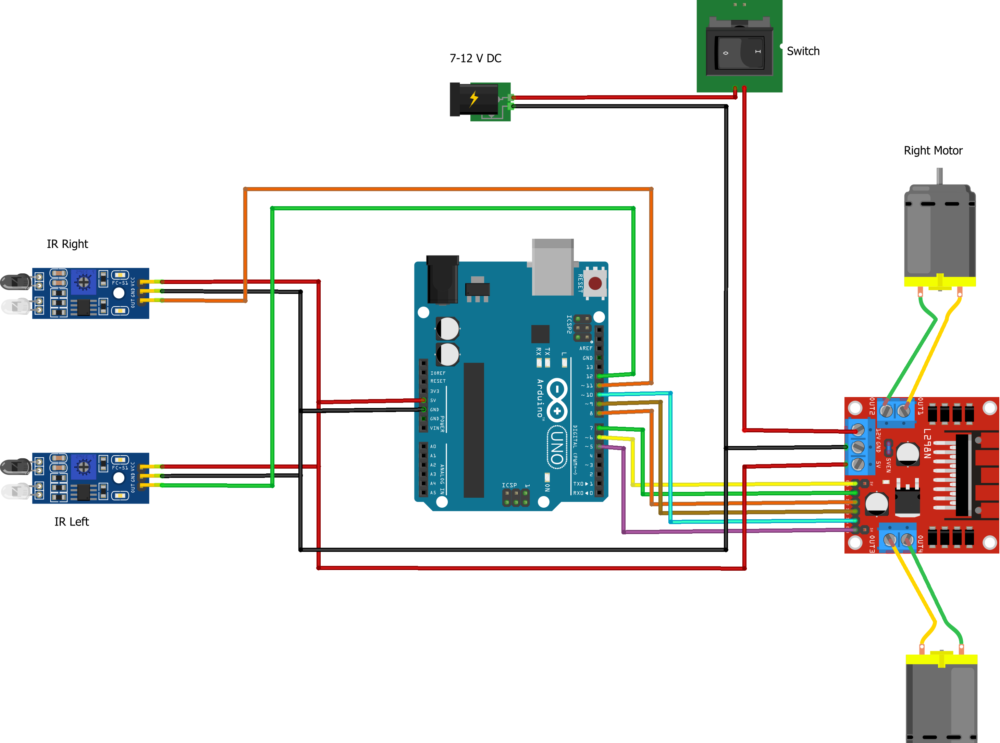

# Line Follower Robot
This project is an Arduino-based line follower robot that uses infrared (IR) sensors to detect and follow a line. The robot consists of an Arduino Uno, two IR sensors, an L298N motor driver, and two DC motors.

## Components Used
  - Arduino Uno
  - 2x IR Sensors
  - L298N Motor Driver
  - 2x DC Motors
  - Breadboard and Connecting Wires
  - 7-12V DC Power Supply
  - Switch

## Circuit Diagram

## How It Works
  - **IR Sensors:** Two IR sensors are used to detect the line. When the sensor detects a line, it outputs a low signal. Otherwise, it outputs a high signal.
  - **Motor Driver:** The L298N motor driver controls the two DC motors based on the signals received from the IR sensors.
  - **Arduino Uno:**  The Arduino Uno reads the signals from the IR sensors and sends appropriate commands to the motor driver to control the movement of the robot.
## Wiring
### 1.IR Sensors:
  - Connect the right IR sensor to digital pin 2 on the Arduino.
  - Connect the left IR sensor to digital pin 3 on the Arduino.
  - Connect the VCC of both sensors to the 5V pin on the Arduino.
  - Connect the GND of both sensors to the GND pin on the Arduino.
### 2.L298N Motor Driver:
  - IN1 and IN2 to digital pins 8 and 9 on the Arduino.
  - IN3 and IN4 to digital pins 10 and 11 on the Arduino.
  - ENA and ENB to 5V (or use PWM pins for speed control).
  - Connect the motors to the OUT1, OUT2, OUT3, and OUT4 pins.
  - Connect the motor driver's GND to the Arduino's GND.
  - Connect the motor driver's VCC to the Arduino's VIN pin (to power the motors from the external power supply).
### 3.Power Supply:
  - Connect the 7-12V DC power supply to the motor driver's power input terminals.
  - Connect the switch between the power supply and the motor driver for easy on/off control.

## Usage
  - Connect all components as per the wiring diagram.
  - Upload the provided code to the Arduino.
  - Place the robot on a surface with a black line on a white background.
  - Turn on the power supply using the switch.
  - The robot will follow the line based on the IR sensor readings.

## Conclusion
This line follower robot project showcases the integration of sensors and motor drivers with an Arduino Uno to create a functional autonomous robot. The use of IR sensors for line detection and the L298N motor driver for motor control demonstrates fundamental concepts in robotics. Future improvements can enhance the robot's performance and capabilities, making it an excellent foundation for more advanced projects.

